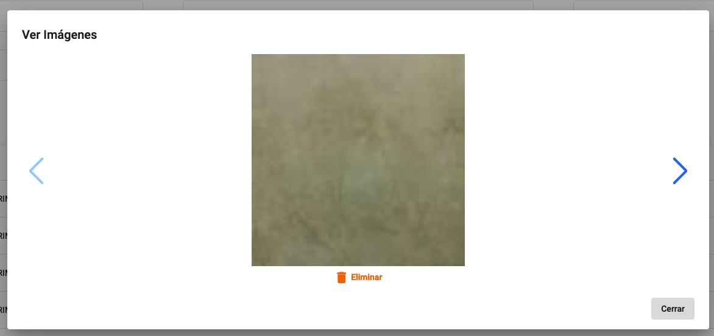

# Artículos

El sistema le permite ver los artículos que se encuentran en Intelisis. Los usuarios de tipo `Administrador` puedes actualizar las imagenes de los artículos.

{: .center}

## Filtrar artículos

Para filtrar los artículos, puede utilizar los siguientes campos:

- `Artículo`: filtra por el código del artículo.
- `Descripción`: filtra por la descripción del artículo.
- `Limite`: limita el número de artículos a mostrar.
- `Código alternativo`: filtra por el código alternativo del artículo.
- `Fabricante`: filtra por el fabricante del artículo.
- `Clave de fabricante`: filtra por la clave del fabricante del artículo.
- `Categoría`: filtra por la categoría del artículo.
- `Tipo de artículo`: filtra por el tipo de artículo.

!!! info "Información"
    Todos los filtros son opcionales. Puede usar el comidín `*` para buscar artículos que contengan el texto ingresado. Por ejemplo, si desea buscar todos los artículos que contengan la palabra `CABLE`, puede ingresar `*CABLE*`.

## Ver imágenes

Todos los usuarios podran ver las imagenes de los artículos, dando click en `Ver`.

!!! warning "Advertencia"
    Solo los usuarios de tipo `Administrador` podran eliminar las imagenes de los artículos.

{: .center}

## Actualizar imágenes

Para actualizar las imágenes de los artículos, debe seleccionar la opción `Agregar`. En la pantalla de agregar, deberá seleccionar el archivo de imagen y dar click en `Guardar`, también puede arrastrar el archivo de imagen a la pantalla.

{: .center}
