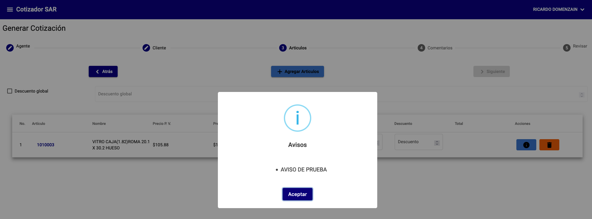
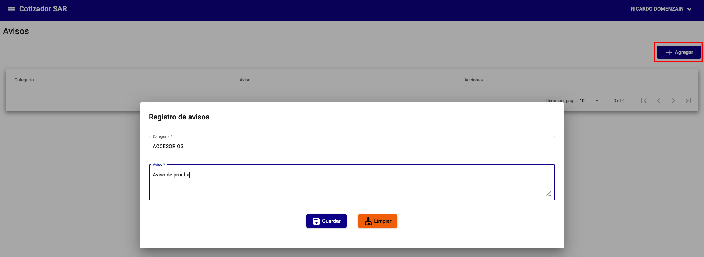
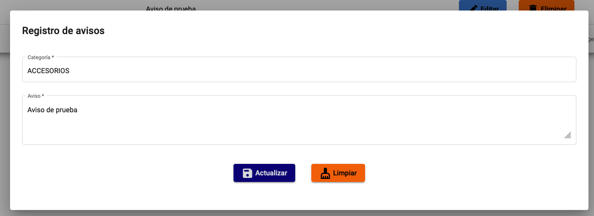
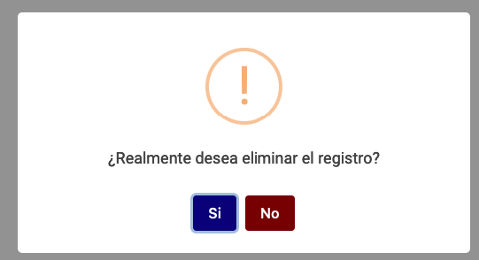

# Avisos

La configuración de avisos se realiza desde el menú **Avisos**.

Estos avisos se muestran en la pantalla del cotizador al agregar un artículo. Los avisos se configurar por categoría de artículo.

!!! info "Información"
    El siguiente ejemplo muestra como se muestra el aviso en la pantalla del cotizador.

{: .center}

## Agregar aviso

Para agregar un aviso deberá seleccionar la opción **Agregar**.

{: .center}

# Editar

Para editar o eliminar un aviso deberá seleccionar la opción **Editar**.

{: .center}

# Eliminar

Para eliminar un aviso deberá seleccionar la opción **Eliminar**.

{: .center}
