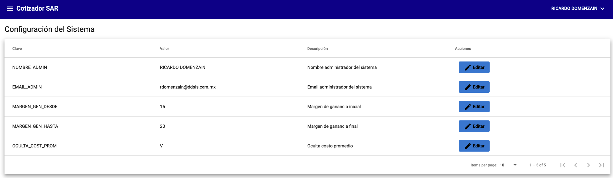
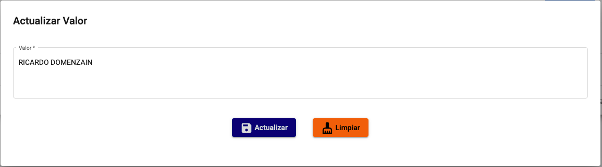

# Configuración del sistema

La aplicación le permite configurar los siguientes parámetros:

- `NOMBRE_ADMIN`: Nombre del administrador
- `EMAIL_ADMIN`: Correo electrónico del administrador
- `MARGEN_GEN_DESDE`: Margen de ganancia inicial (Solo permite números)
- `MARGEN_GEN_HASTA`: Margen de ganancia final (Solo permite números) 
- `OCULTA_COST_PROM`: Ocultar costo promedio (Solo permite valores `V` o `F`)

{: .center}

## Editar configuración

Para editar la configuración, debe hacer clic en el botón `Editar` en el parametro que desea editar.

{: .center}
