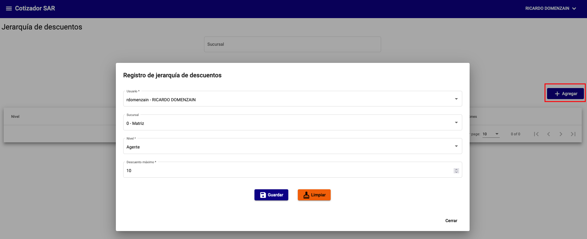
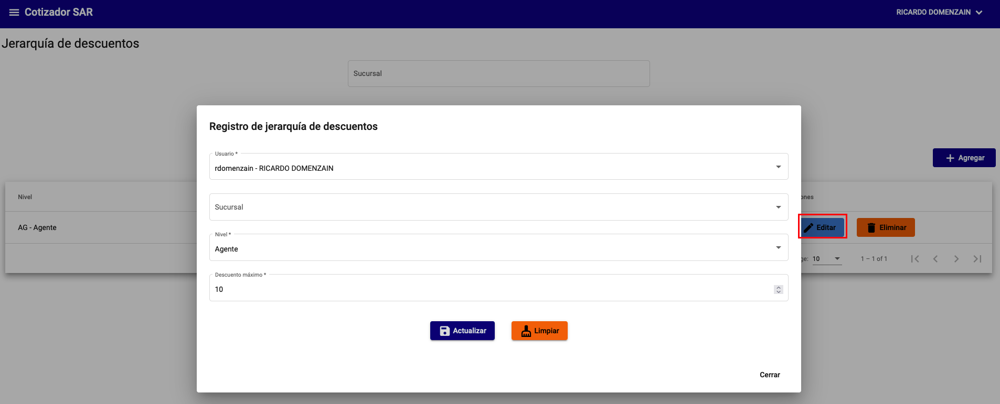
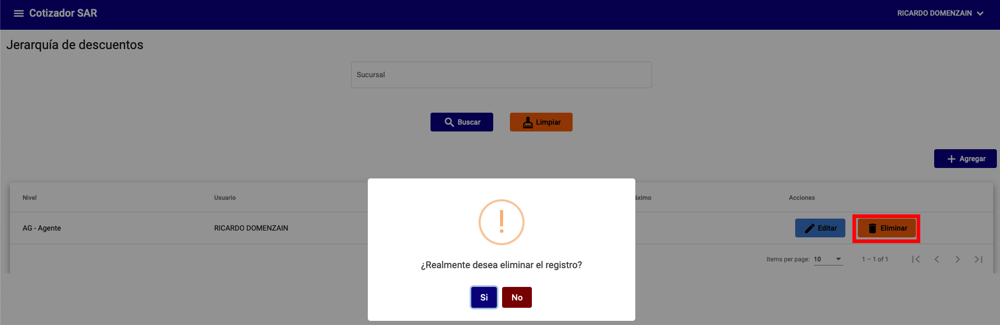
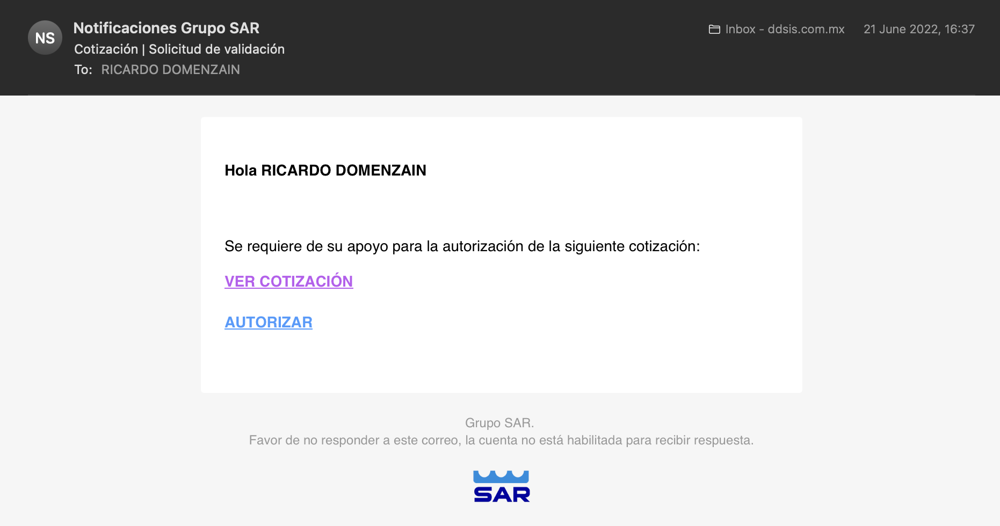

# Jerarquía de descuentos

La jerarquía de descuentos es la forma en la que se aplican los descuentos a las cotizaciones. Existen 4 niveles de jerarquía:

1. `Agente`
2. `Gerente`
3. `Director de construcción`
4. `Director general`

Los descuentos se aplican de acuerdo a la jerarquía, es decir, si un agente aplicará un descuento de 10% y tiene configurado una jerarquía de descuentos de 5%, se le solicitara al Gerente que autorice el descuento de 10% y no de 5%, incluso si el Gerente no tiene configurado un descuento mayor de 10%, se solicitará al Director de construcción que autorice el descuento, o en su defecto, al Director general.

Las solicitudes de descuentos se envían a los correos electrónicos de los usuarios que tienen configurado un descuento mayor al que se solicita.

Puede configurar descuentos a nivel sucursal o para todas las sucurales de la empresa.

## Configurar descuentos

Para crear un descuento, debe ir a la sección de **Jerarquía de descuentos** y seleccionar **Agregar**.

{: .center}

## Editar descuentos

Para editar un descuento, debe ir a la sección de **Jerarquía de descuentos** y seleccionar **Editar** al lado del descuento que desea editar.

{: .center}

## Eliminar descuentos

Para eliminar un descuento, debe ir a la sección de **Jerarquía de descuentos** y seleccionar **Eliminar** al lado del descuento que desea eliminar.

{: .center}

## Correo electrónico de notificación

Cuando se solicita un descuento, se envía un correo electrónico al usuario que tiene configurado un descuento mayor al que se solicita. Este correo electrónico se envía a la dirección de correo electrónico que se configura en la sección de **Usuarios**.

{: .center}
