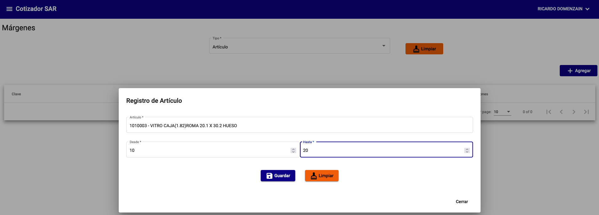
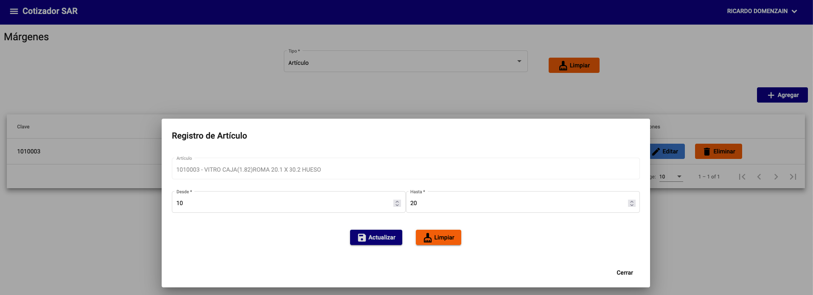
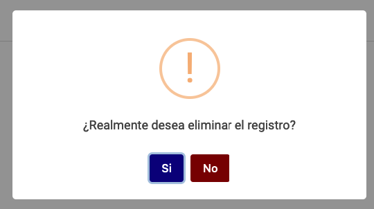

# Márgenes

Los margenes son los porcentajes que se aplican a los precios de los productos para obtener el precio de venta. Estos porcentajes se configurar por `Artículo`, `Categoría` o `Proveedor`.

## Agregar un margen

Para agregar un margen, debe ir a la sección `Márgenes` y seleccionar el tipo de margen que desea agregar, posteriormente de clic en el botón `Agregar`.

!!! warning "Advertencia"
    Por cada tipo de margen el combo `Artículo`, `Categoría` o `Proveedor` es una lista desplegable, por lo que solo se puede seleccionar un elemento.

{: .center}

## Editar un margen

Para editar un margen, debe ir a la sección `Márgenes` y seleccionar el tipo de margen que desea editar, posteriormente de clic en el botón `Editar`.

{: .center}

## Eliminar un margen

Para eliminar un margen, debe ir a la sección `Márgenes` y seleccionar el tipo de margen que desea eliminar, posteriormente de clic en el botón `Eliminar`.

{: .center}
