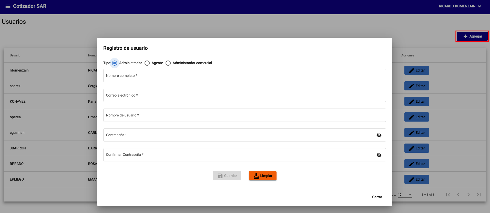
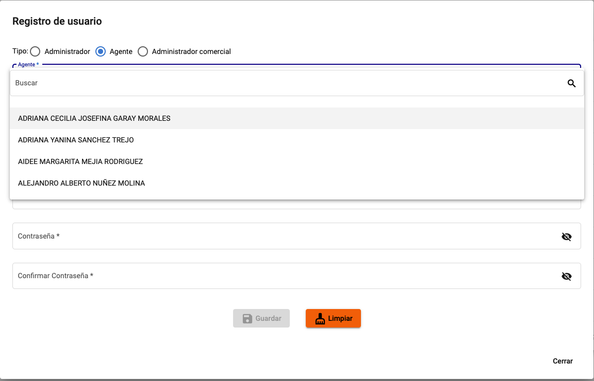
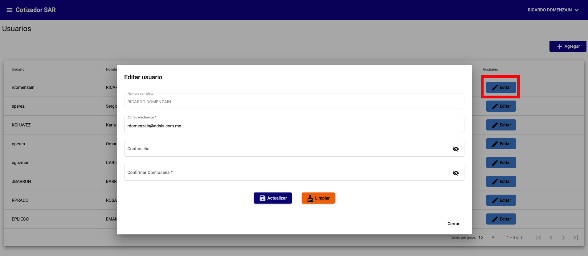
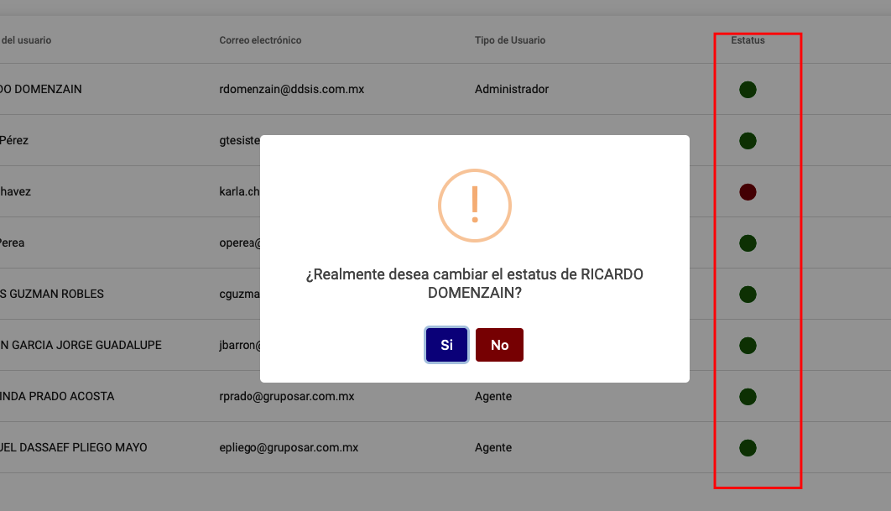

# Usuarios

La administración de usuarios se realiza desde el menú **Usuarios**.

!!! info "Información"
    El sistema enviará un correo electrónico al administrador para notificarle que se ha creado un nuevo usuario.

## Crear usuario

Para crear un nuevo usuario deberá seleccionar la opción Agregar.

Puede crear un usuario con los siguientes roles:

- `Administrador`: puede realizar todas las acciones del sistema.
- `Agente`: puede realizar todas las acciones del sistema, excepto la administración de usuarios.
- `Administrador de comercial`: puede realizar todas las acciones del sistema, excepto la administración de usuarios y la administración de agentes.

{: .center}

Para los roles de Agente y Administrador de comercial, deberá seleccionar el Agente al que pertenecerá. Estos datos se obtienen de Intelisis.

{: .center}

## Editar usuario

Para editar un usuario deberá seleccionar la opción Editar.

!!! warning "Advertencia"
    Solo podrá editar el correo electrónico y contraseña.

{: .center}

## Activar / Desactivar usuario

Para activar o desactivar un usuario deberá seleccionar el icono verde para desactivar y rojo para activar.

{: .center}
