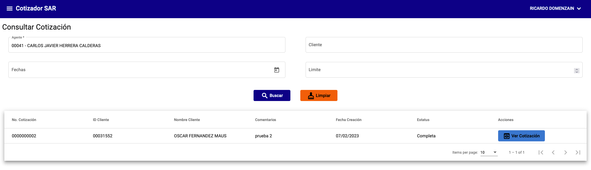
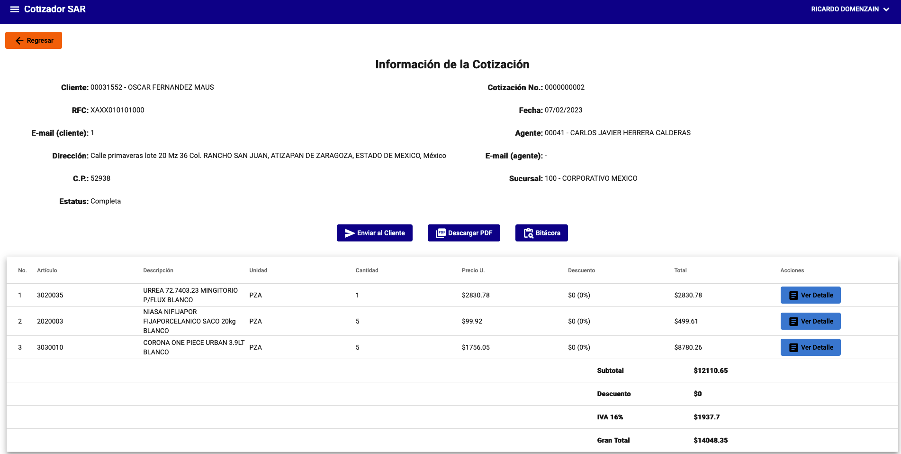
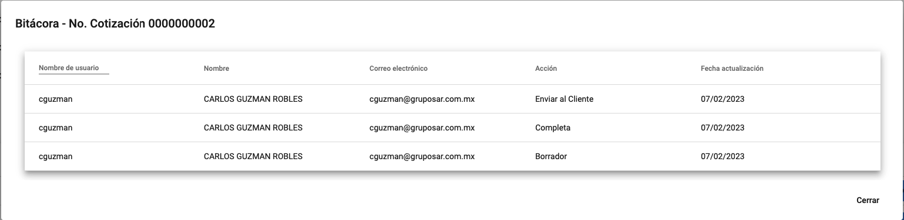

# Consultar cotizaciones

La consulta de cotizaciones permite obtener información de las cotizaciones generadas en el sistema. Para consultar una cotización, se debe ingresar a la sección de **Cotizador** y seleccionar la opción **Consultar Cotización**.

A los usuarios con permisos de **Administrador** se les permite consultar cotizaciones de cualquier agente. A los usuarios con permisos de **Agente** se les permite consultar cotizaciones de si mismo.

{: .center}

!!! info "Información"
    Si la cotización se encuentra en estado **Borrador** se le permite al usuario modificarla. Para más información ver [Generar cotización](./generar.md#paso-5-revision).

## Filtros

La consulta de cotizaciones permite filtrar por los siguientes campos:

- **Agente**: Permite filtrar por el agente que generó la cotización.
- **Cliente**: Permite filtrar por el cliente al que se le generó la cotización.
- **Fecha**: Permite filtrar por la fecha en que se generó la cotización.
- **Limite**: Limita la cantidad de resultados que se muestran en la tabla.

## Ver cotización

Al seleccionar una cotización se muestra la información de la misma.

{: .center}

### Enviar cotización

Al seleccionar la opción **Enviar al cliente** se envía la cotización al cliente por correo electrónico. Para más información ver [Enviar cotización](./generar.md#correo-electronico-de-la-cotizacion).

### Descargar cotización

Al seleccionar la opción **Descargar PDF** se descarga la cotización en formato PDF.

### Bitácora

Al seleccionar la opción **Bitácora** se muestra la bitácora de la cotización.

{: .center}

### Detalle de la partida

Al seleccionar la opción **Ver Detalle** se muestra el detalle de la partida de la cotización. Para más información ver [Detalle de la partida](./generar.md#detalle-de-la-partida).
