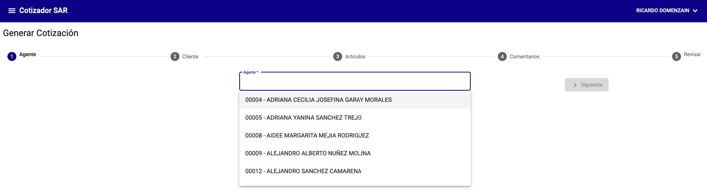
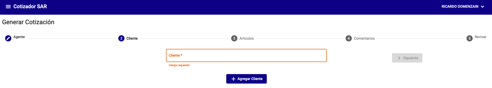
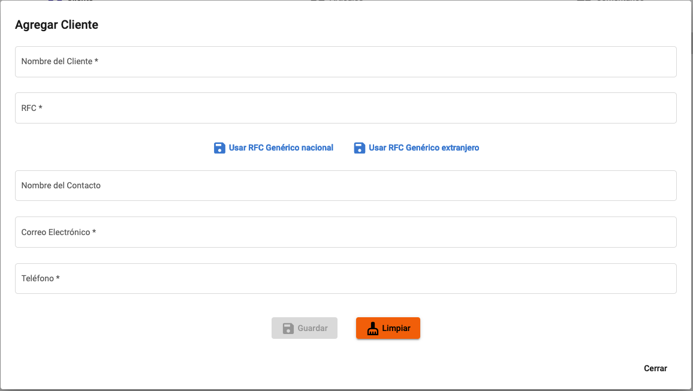
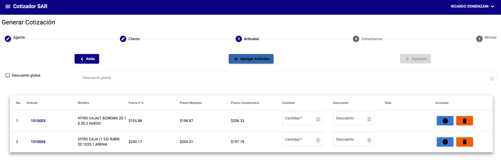
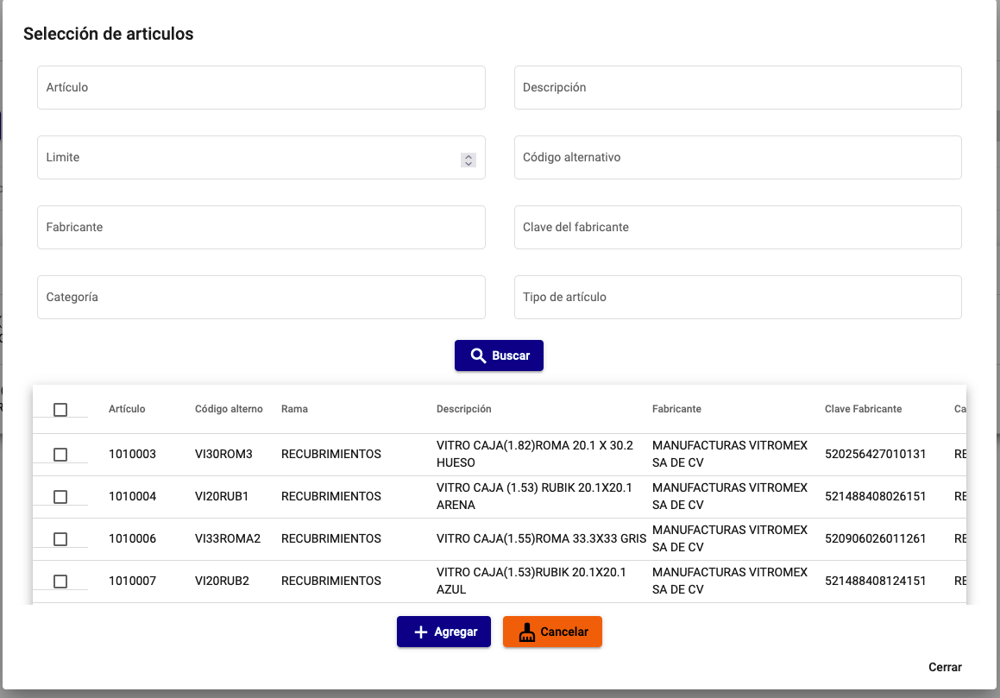
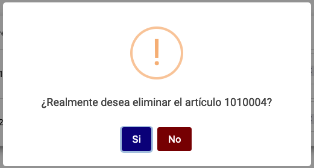
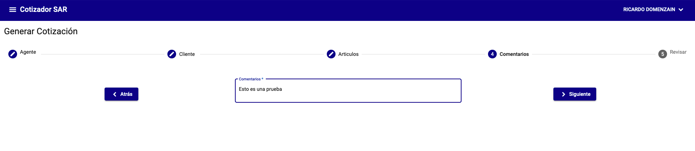
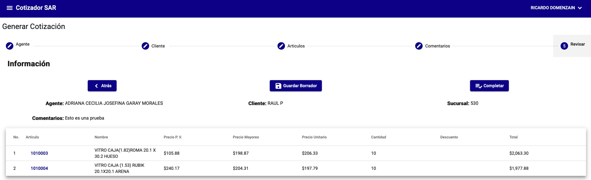
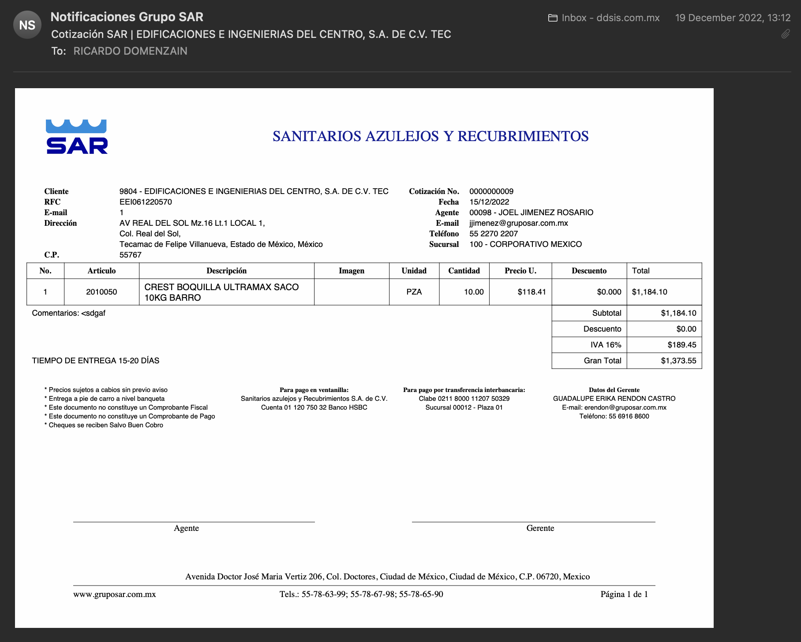

# Crear cotizaciones

La creación de cotizaciones se realiza desde el menú **Cotizador / Generar Cotización**. La generación de cotizaciones consta de 4 pasos para los agentes y 5 para los administradores.

## Paso 1 - Agente

En el primer paso se debe seleccionar el agentes que realizará la cotización.

!!! warning "Atención"
    Los usuarios con perfil de **Agente** no deben seleccionar ningún agente. Se tomará el agente que se encuentra logueado.

{: .center}

## Paso 2 - Cliente

En el segundo paso se debe seleccionar el cliente al que se le realizará la cotización.

{: .center}

Si el cliente no se encuentra en la lista se debe seleccionar la opción **Agregar** para crear un nuevo cliente.

{: .center}

## Paso 3 - Artículos

En el tercer paso se debe seleccionar los artículos que se cotizarán.

{: .center}

Para agregar un artículo se debe seleccionar la opción **Agregar**.

!!! info "Información"
    - El diálogo para agregar un artículo tiene los mismos campos de filtrado que el de la pantalla de artículos. Para más información ver [Artículos](./../administracion/articulos.md#filtrar-articulos).
    - Al agregar un artículo se debe seleccionar la cantidad que se cotizará y descuento que se aplicará al artículo si es que se aplica.
    - Si se tiene configurado un aviso para la categoría del artículo se mostrará en la pantalla del cotizador. Para más información ver [Avisos](./../administracion/avisos.md#avisos).

{: .center}

### Detalle de la partida

Muestra la información del calculo del precio del artículo.

{: .center}

### Eliminar artículo

Elimina el artículo de la cotización.

{: .center}

## Paso 4 - Comentarios

En el cuarto paso se debe ingresar los comentarios que se deseen agregar a la cotización.

{: .center}

## Paso 5 - Revisión

En el quinto paso se debe revisar la cotización.

Tiene dos opciones:

- **Guardar como borrador**: Guarda la cotización como borrador para que pueda ser modificada posteriormente.
- **Completar**: Genera la cotización y la envía al cliente.

!!! info "Información"
    Al completar la cotización se le habilitará una opción para enviar la cotización al cliente por correo electrónico. Y podrá descargar la cotización en formato PDF.

{: .center}

### Correo electrónico de la cotización

Si se desea enviar la cotización al cliente por correo electrónico se debe seleccionar la opción **Enviar por correo electrónico**.

{: .center}
