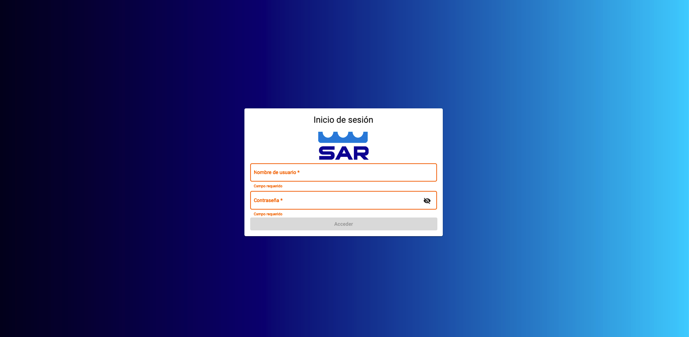
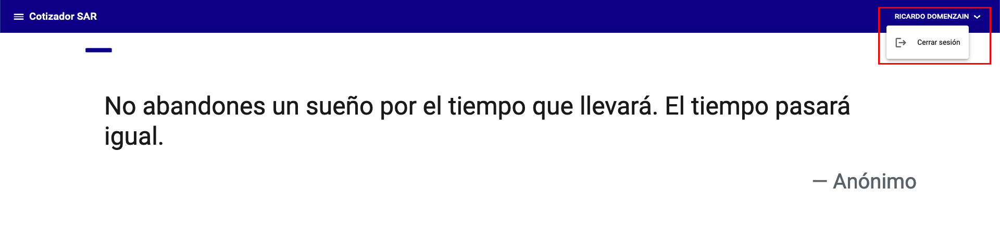
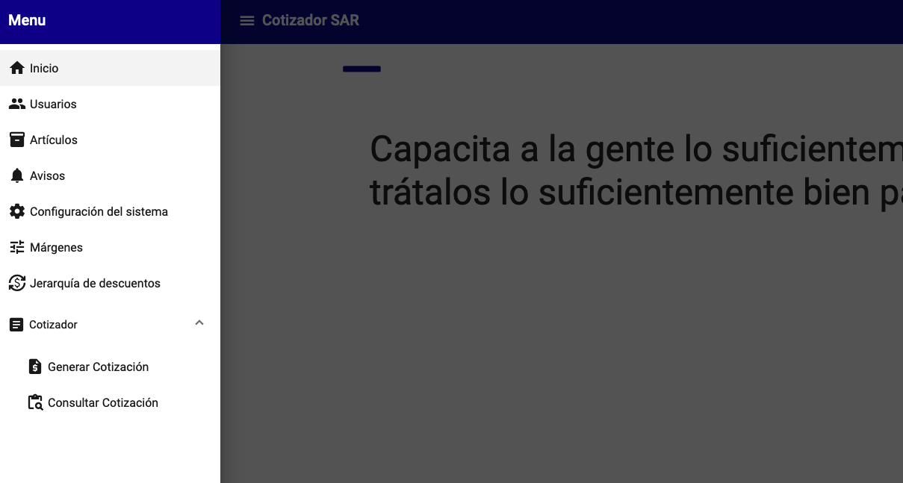

# Introducción

Esta es la documentación oficial del [Cotizador SAR](https://cotizador-sar.ddsis.com.mx)

## ¿Qué es el Cotizador SAR?

El Cotizador SAR es una aplicación web que permite a los agentes cotizar los productos de Grupo SAR.

## ¿Cómo funciona?

El Cotizador SAR se conecta a la [API de Grupo SAR](https://cotizador-api.ddsis.com.mx/docs) para obtener los productos y cotizarlos.

## Tipo de usuario

### Agente

Los usuarios de tipo agente son los que pueden cotizar los productos de Grupo SAR.

### Administrador comercial

Los usuarios de tipo administrador comercial son los que pueden cotizar los productos de Grupo SAR y administrar los agentes.

### Administrador

Los usuarios de tipo administrador son los que pueden administrar los usuarios, articulos, configuraciones, etc.

## Login

Debe ingresar su usuario y contraseña para poder acceder al Cotizador SAR.

{: .center}

## Inicio

En la pantalla de inicio se muestras mensajes motivacionales. En la parte superior derecha se muestra el nombre del usuario y un botón para cerrar sesión.

{: .center}

## Menú

En el menú se muestran las opciones disponibles para el usuario.

!!! warning "Advertencia"
    El menú cambia dependiendo del tipo de usuario.

{: .center}
